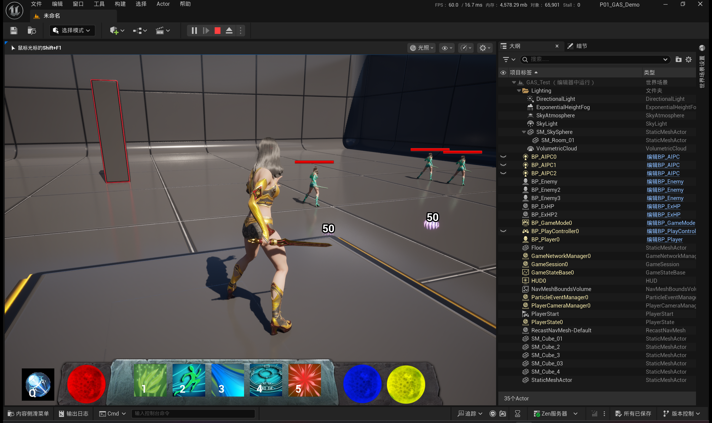
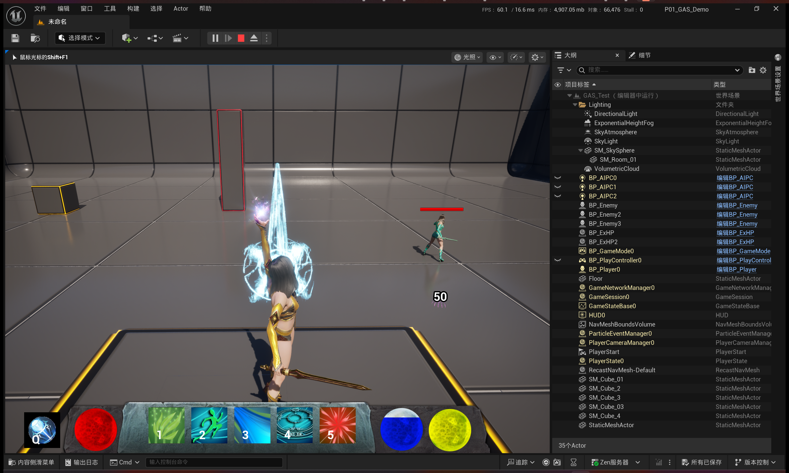
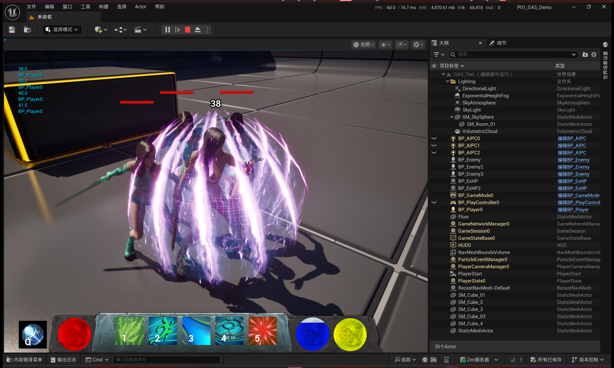
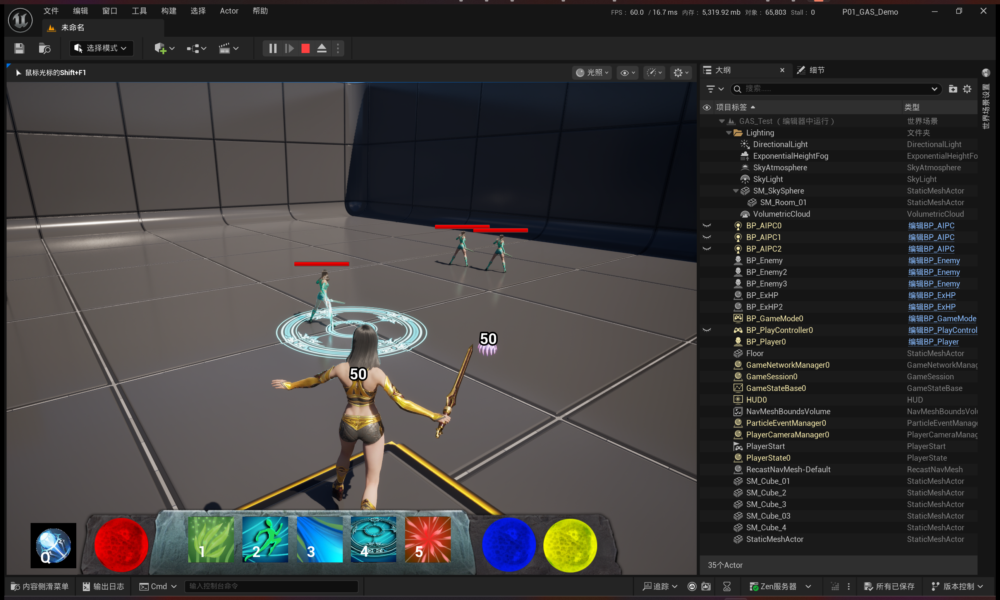
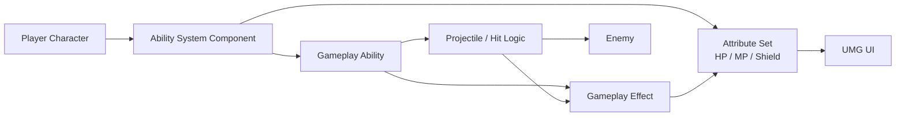

# UE5 GAS Combat Demo Portfolio

> 基于 Unreal Engine 5 与 Gameplay Ability System（GAS）实现的动作战斗演示项目，重点展示技能系统、属性系统、护盾机制、投射物逻辑、UI 联动以及 Blueprint / C++ 混合开发实践。

---

## 项目简介

这是一个基于 **Unreal Engine 5** 开发的个人战斗系统练习项目，核心目标是围绕 **Gameplay Ability System（GAS）** 搭建一个可扩展的基础战斗框架，并完成以下关键能力的实现：

- 技能释放与冷却管理
- 资源消耗与伤害生效
- HP / MP / 护盾（ExHP）属性系统
- 投射物与命中逻辑
- UI 与属性状态同步
- Blueprint 与 C++ 混合开发与调试

本仓库为 **作品集展示版仓库**，重点展示项目效果、核心功能、系统设计思路以及个人实现内容。

---

- - 演示视频

    其余不便通过单张截图完整展示的动态内容，如技能完整释放流程、战斗反馈、角色移动、UI 变化等，统一放在 GitHub Release 中展示。

    - Demo Video: [查看最新演示视频 Release](https://github.com/Kakyoin61/UE5-GAS-CombatDemo-Portfolio/releases/latest)

---

### 项目截图

#### 1. 进入游戏后的整体界面
该截图用于展示项目的整体运行状态，包括角色、敌人、场景以及底部技能栏 UI。  
主要体现：**项目已具备完整的基础战斗 Demo 形态，而不仅仅是单独功能测试。**



---

#### 2. 激光技能释放界面
该截图用于展示角色技能释放时的实际战斗表现。  
主要体现：**项目中已实现可触发的技能系统，并具备技能动作、特效与战斗反馈表现。**



---

#### 3. 拾取护盾效果
该截图用于展示角色拾取护盾后的视觉反馈与状态表现。  
主要体现：**项目中除基础战斗外，还实现了护盾 / 额外生命值机制，并具备对应的表现效果。**



---

#### 4. 技能选取范围状态
该截图用于展示技能释放前的范围选择与目标指示状态。  
主要体现：**部分技能具备施法前选区与范围预览机制，技能交互流程更加完整。**



---

## 核心功能

### 1. 基于 GAS 的技能系统
- 使用 Gameplay Ability System 组织角色技能逻辑
- 支持技能激活、冷却、消耗、伤害生效等基础流程
- 技能结构具备一定扩展性，便于后续增加新技能

### 2. 角色属性系统
- 实现角色 **HP / MP / 护盾（ExHP）** 等属性逻辑
- 支持属性变化驱动 UI 更新
- 支持技能消耗、生命恢复、护盾替换与重置等机制

### 3. 战斗与伤害结算
- 实现近战 / 远程技能的基础战斗流程
- 支持投射物攻击、命中检测、伤害应用与受击反馈
- 通过 Gameplay Effect 驱动部分伤害与资源变化逻辑

### 4. UI 联动
- 实现主界面属性条、技能槽、护盾显示等功能
- 将角色属性变化同步到 UMG 界面
- 支持技能图标、状态表现与基础交互反馈

### 5. 技能选区与目标选择
- 部分技能支持施法前范围预览
- 支持目标选择 / 落点选取类交互逻辑
- 提升技能系统的完整度与可玩性表现

---

## 技术栈

- **Engine**: Unreal Engine 5
- **Language**: C++
- **Gameplay Logic**: Blueprint
- **Framework**: Gameplay Ability System (GAS)
- **UI**: UMG
- **Version Control**: Git / GitHub

---

## 系统结构


## 技能模块展示

当前项目包含多个基础能力模块，用于构成完整的战斗演示流程：

- **Melee**
- **HP Regen**
- **Dash**
- **Laser**
- **Ground Blast**
- **Fire Blast**
- **Bullet**

这些模块共同体现了：

- 技能释放
- 冷却管理
- 蓝量消耗
- 伤害生效
- 状态变化
- UI 联动
- 范围选择与命中反馈

---

## 我的工作

本项目中，我主要完成了以下内容：

- 理解并搭建基于 **GAS** 的基础战斗逻辑流程
- 实现并调试技能释放、冷却、消耗与伤害应用流程
- 设计并完善角色 **HP / MP / 护盾** 属性交互逻辑
- 完成护盾拾取、替换、重置与 UI 同步相关实现
- 实现投射物攻击与命中反馈相关逻辑
- 处理 Blueprint 与 C++ 混合开发中的空引用、状态残留、头文件缺失、编译报错等问题
- 梳理项目结构与模块关系，逐步形成可用于展示的战斗系统 Demo

---

## 开发中的典型问题与解决

### 技能多次释放后状态未正确重置
在技能反复释放过程中，曾出现变量状态残留、后续技能无法正常进入逻辑的问题。  
后续通过梳理 Ability 生命周期、检查结束节点与变量恢复时机，逐步完成修复。

### 护盾重复拾取后状态异常
初始实现中护盾值存在旧状态残留问题，导致重新拾取护盾时未正确初始化。  
后续通过重置护盾当前值、UI 状态与护盾失效标记，修复了重复拾取后的异常表现。

### Blueprint 空引用与无访问错误
在蓝图调用过程中，多次遇到对象为空、读取失败或无访问权限的问题。  
通过增加判空、检查对象获取时机、梳理调用链路，提升了蓝图逻辑稳定性。

### C++ 编译与头文件依赖问题
开发中曾出现类型不完整、头文件缺失、编译报错等问题。  
通过补充头文件、调整依赖关系和检查实现文件组织，解决了相关问题。

---

## 项目收获

通过本项目，我进一步加深了对以下内容的理解：

- UE5 基础游戏框架与角色系统
- Gameplay Ability System 的核心工作方式
- Gameplay Effect 与属性系统之间的关系
- Blueprint 与 C++ 联动开发中的常见问题
- 战斗系统中状态管理与 UI 同步的重要性
- 如何将“能运行的练习项目”整理成“可展示的作品集项目”

---

## 仓库说明

本仓库为 **展示版仓库**，重点呈现项目效果、实现思路与个人能力说明。

- 完整开发工程用于本地或私有环境继续维护
- 公开仓库以作品展示和能力表达为主
- 部分演示中使用的模型、特效或素材资源归原作者或对应权利方所有
- 本仓库中的第三方内容仅用于项目展示说明，不作为单独资源分发

---

## 后续优化方向

- 增加更多技能与连招逻辑
- 增加更完整的敌人 AI 行为
- 优化受击反馈、音效与特效表现
- 补充更完整的系统架构图与模块说明
- 进一步提升项目的可扩展性与可维护性

---

## 仓库结构示例

```text
P01_GAS_Demo/
├─ Config/
├─ Content/
├─ Docs/
│  └─ screenshots/
│     ├─ scene_overview.png
│     ├─ skill_laser.png
│     ├─ shield_pickup.png
│     └─ skill_targeting.png
├─ Source/
├─ .gitignore
├─ P01_GAS_Demo.uproject
└─ README.md
```

## 联系方式

- GitHub: [Kakyoin61](https://github.com/Kakyoin61)
- Email: 17769127245@163.com
- Resume / Portfolio: 

---

## 致谢

感谢 Unreal Engine 生态、GAS 相关学习资料以及项目实践过程中接触到的官方 / 开源示例资源，为本项目的学习与实现提供了参考。